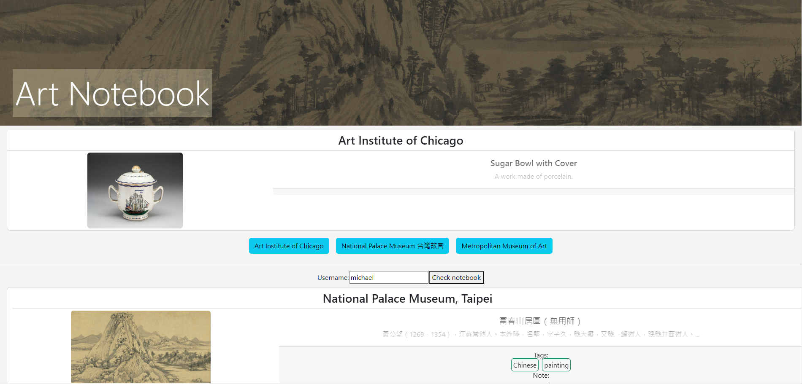

# Art Notebook

This web application can display an artwork from various museums every day. If the user finds it interesting, he can add custom tags and save it for later retrieval.  

## Application structure

The frontend is built with React, TypeScript and Bootstrap.

The backend is built with Go, using the Fiber framework.  When the frontend makes calls the backend through its api, the backend would make calls to external apis and return data to frontend.

## Screenshot

